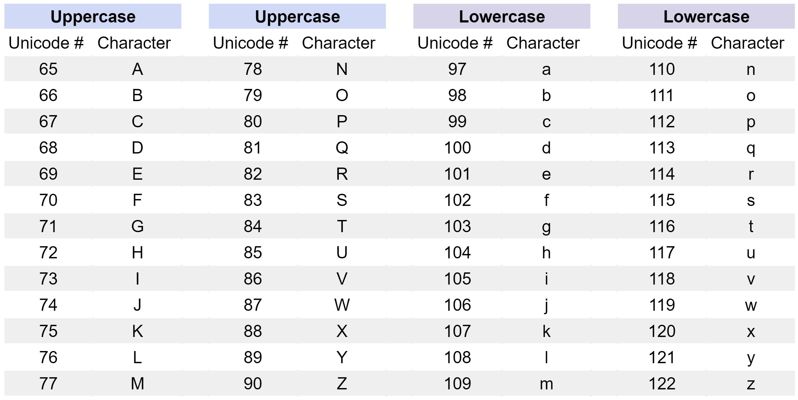

# Condicionales

## Reseña: Comparando cosas
- Estos son los ejemplos usados en el siguiente video:
```Python
print(10>1)
#True
print("cat" == "dog")
#False
print (1 != 2)
#True

print(1 < "1")
#Will return a type error

print(1 == "1")
#False

print("Yellow" > "Cyan" and "Brown" > "Magenta")
#False

print(25 > 50 or 1 != 2)
#True

print(not 42 == "Answer")
#True
```

---

## Comparando cosas
- Python puede comparar cosas
    - Si algo es pequeño o grande que otra cosa
- Booleanos: True o False
- Operadores de comparación: `==`, `!=`, `<`, `>`, `<=`, `>=`
    - `==` es igual a
    - `!=` es diferente a
    - `<` es menor que
    - `>` es mayor que
    - `<=` es menor o igual que
    - `>=` es mayor o igual que
- En Python podemos comparar números, strings y booleanos
- Operadores lógicos: `and`, `or`, `not`
    - `and` devuelve True si ambos son True
    - `or` devuelve True si al menos uno es True
    - `not` devuelve True si el valor es False y viceversa

---

## Operadores de comparación con ecuaciones
- Los comparadores retornan un valor booleano (True o False)
- Operador `==` y `!=` 
```Python

print(32 == 30+2)   # The == operator checks if the 2 values are 
True                # equal to each other. If they are equal, 
                    # Python returns a True result.


print(5+10 == 6+7)  # If the two values are not equal, as in the
False               # expression 5+10 == 6+7 (or 15 == 13), Python          
                    # returns a False result.


print(10-4 != 10+4) # The != operator checks if the 2 values are
True                # NOT equal to each other. If true, Python              
                    # returns a True result. 


print(9/3 != 3*1)   # In this last example, 9/3 != 3*1 (or 3 != 3)
False               # is false. So, Python returns a False value.
```
- El operador `==` vs el operador `=`
    - El operador `=` es un operador de asignación, no de comparación
    - El operador `==` es un operador de comparación, no de asignación
```Python

# The = equals assignment operator is used to assign a value to a 
# variable.

my_variable = 3*5           # Assigns a value to my_variable      
print(my_variable)          # Printing the variable returns the 
15                          # value assigned to the variable.


                              
# The == equality comparison operator checks if the values of the two
# expressions on either side of the == operator are equivalent to one 
# another.
      
print(my_variable == 3*5)   # Printing the variable returns a Boolean 
True                        # True or False result. 
```
- Mayor que y menor que
```Python

print(11 > 3*3)         # The > operator checks if the left value is
True                    # greater than the right value. If true, it
                        # returns a True result.


print(4/2 > 8-4)        # If the > operator finds that the left value
False                   # is NOT greater than the right value, the
                        # comparison will return a False result.


print(4/2 < 8-4)        # The < operator checks  if the left value is
True                    # less than the right side. If true, the
                        # comparison returns a True result.


print(11 < 3*3)         # If the < operator finds that the left side is False                   
                        # NOT less than the right value, Python returns
False                   # a False result.
```
- Mayor o igual que y menor o igual que
```Python

print(12*2 >= 24)   # The >= operator checks if the left value is
True                # greater than or equal to the right value. 
                    # If one of these conditions is true,  
                    # Python returns a True result. In this case  
                    # the two values are equal. So, the comparison
                    # returns a True result.


print(18/2 >= 15)   # If the >= comparison determines that the left
False               # value is NOT greater than or equal to the
                    # right, it returns a False result.

print(12*2 <= 30)   # The <= operator checks if the left value is
True                # less than or equal to the right value. In 
                    # this case, the left value is less than the
                    # right value. Again, if one of the two 
                    # conditions is true, Python returns a True
                    # result.


print(15 <= 18/2)   # If the <= comparison determines that the left 
False               # value is NOT less than or equal to the right
                    # value, the comparison returns a False result. 
```

---

## Operadores de comparación con strings
- Si utiliza los operadores == (igualdad) y != (distinto de) con cadenas de texto, podrá comprobar si dos cadenas contienen el mismo texto. También puede ordenar alfabéticamente las cadenas utilizando los operadores de comparación > (mayor que), < (menor que), >= (mayor o igual que) y <= (menor o igual que). Al igual que con los tipos de datos numéricos, los operadores de comparación utilizados con cadenas de texto devolverán resultados booleanos (Verdadero o Falso).
- Operador `==` y `!=`
```Python
# The == operator can check if two strings are equal to each other. 
# If they are equal, the Python interpreter returns a True result.
print("a string" == "a string")
True


# In this example, the equality == comparison is between "4 + 5" and
# 4 + 5. Since the left data type is a string and the right data type
# is an integer, the two values cannot be equal. So, the comparison
# returns a False result.
print("4 + 5" == 4 + 5)
False


# The != operator can check if the two strings are NOT equal to each
# other. If they are indeed not equal, then Python returns a True result.
print("rabbit" != "frog")
True


# In this example, the variable event_city has been assigned the string 
# value "Shanghai". This variable is compared to a static string, 
# "Shanghai", using the != operator. As, the strings "Shanghai" and 
# "Shanghai" are the same, the comparison of "Shanghai" != "Shanghai" 
# is false. Accordingly, Python will return a False result.
event_city = "Shanghai"
print(event_city != "Shanghai")
False

# This last example illustrates the result of trying to compare two
# items of different data types using the equality == operator. The
# two items are not equal, so the comparison returns False.
print("three" == 3)
False
```
- Mayor que y menor que
    - En Python, los operadores de comparación mayor que > y menor que < permiten ordenar palabras alfabéticamente. Las letras del alfabeto tienen códigos numéricos en Unicode (también conocidos como valores ASCII).
    - Las letras mayúsculas de la A a la Z se representan con los valores Unicode del 65 al 90. Las letras minúsculas de la a a la z se representan con los valores Unicode del 97 al 122.

```Python
# The greater than > operator checks if the left string has a higher 
# Unicode value than the right string. If true, the Python interpreter
# returns a True result. Since W has a Unicode value of 87, and you can 
# easily calculate that F has a Unicode value of 70, this comparison is
# the same as 87 > 70. As this is true, Python will return a True 
# result.
print("Wednesday" > "Friday")
True
 
 
# The less than < operator checks if the left string has a lower 
# Unicode value than the right string. If you reference the Unicode 
# chart above, you can see that all lowercase letters have higher 
# Unicode values than uppercase letters. We can see that B has a 
# Unicode value of 66 and b has a Unicode value of 98. This 
# comparison is the same as 66 < 98, which is true. So, Python will 
# return a True result.
print("Brown" < "brown")
True


# If the strings have the same first few letters, the comparison will 
# cycle through each letter of each string, from left to right until it 
# finds two letters that have different Unicode values. In this example, 
# both strings share the initial substring "sun", but then have 
# different letters with different Unicode values in the fourth place 
# in each string. So, the fourth letters 'b' and 't' of the two
# strings are used for the comparison. Since 'b' does not have a higher
# Unicode value than 't', the comparison returns a False result.
print("sunbathe" > "suntan")
False


# If two identical strings are compared using the less than < comparison
# operator, this will produce a False result because they are equal.
print("Lima" < "Lima")
False


# This last example illustrates the result of trying to compare two
# items of different data types using the less than < operator. The 
# greater than > and less than operators < cannot be used to compare
# two different data types. 
print("Five" < 6)
'''
Error on line 1:
    print("Five" < 6)
TypeError: '<' not supported between instances of 'str' and 'int'
```
- Mayor o igual que y menor o igual que
    - Los operadores mayor o igual que (>=) y menor o igual que (<=) también se pueden usar con cadenas de texto. Al igual que los demás operadores de comparación, devuelven un resultado booleano (verdadero o falso) cuando se comparan dos cadenas.
    - Para comprobar si una cadena tiene un valor Unicode mayor o igual que la(s) primera(s) letra(s) de otra cadena, utilice el operador mayor o igual que: >=
    - Para comprobar si una cadena tiene un valor Unicode menor o igual que la(s) primera(s) letra(s) de otra cadena, utilice el operador menor o igual que: <=
```Python
# Use the Unicode chart in Part 2 to determine if the Unicode values of 
# the first letters of each string are higher, lower, or equal to one
# another. 


var1 = "my computer" >= "my chair"
var2 = "Spring" <= "Winter"
var3 = "pineapple" >= "pineapple"
 
print("Is \"my computer\" greater than or equal to \"my chair\"? Result: ", var1)
print("Is \"Spring\" less than or equal to \"Winter\"? Result: ", var2)
print("Is \"pineapple\" less than or equal to \"pineapple\"? Result: ", var3)
```

---

## Operadores lógicos
- Los operadores lógicos  son usados para expresiones más complejas.
- Puedes hacer más compleja una comparación uniendo varias comparaciones con los operadores lógicos `and`, `or` y `not`.
    - `and` devuelve True si toda la operación es True
    - `or` devuelve True si al menos una de las operaciones es True
    - `not` devuelve True si la operación es False y viceversa
- Ejemplos:
1. `and`:
```Python
# Example 1

print((6*3 >= 18) and (9+9 <= 36/2))

# Example 2 - Python resuelve los valores de las expresiones antes de compararlos
(6*3 >= 18) and (9+9 <= 36/2)
# becomes
(18 >= 18) and (18 <= 18)

# Example 3

print("Nairobi" < "Milan" and "Nairobi" > "Hanoi")
```
2. `or`:
```Python
# Expression1 or Expression2
# Define country and city variables
country = "United States"
city = "New York City"

# True or True returns True
print((15/3 < 2+4) or (0 >= 6-7))  # True or True = True

# False or True returns True
print(country == "New York City" or city == "New York City")  # False or True = True

# True or False returns True
print(16 <= 4**2 or 9**(0.5) != 3)  # True or False = True

# False or False returns False
print("B_name" > "C_name" or "B_name" < "A_name") # False or False = False
```
3. `not`:
```Python
# Si la expresión condicional es True, el operador not cambiará el resultado a False.
# Si la expresión condicional es False, el operador not cambiará el resultado a True.
# not expression
# Test Example 1:

x = 2*3 > 6
print("The value of x is:")
print(x)

print("")  # Prints a blank line

print("The inverse value of x is:")
print(not x)

# What happens when you negate a False statement? 
# Click Run when you are ready to check your answer.


today = "Monday"
print(not today == "Tuesday") 


# The "today" variable states today is Monday. This makes the comparison
# "today == Tuesday" False. The logical operator "not" inverts the False
# result to become True. In other words, this expression asks if it is
# false that today is not Tuesday. More succinctly, "not False" means 
# True."

```