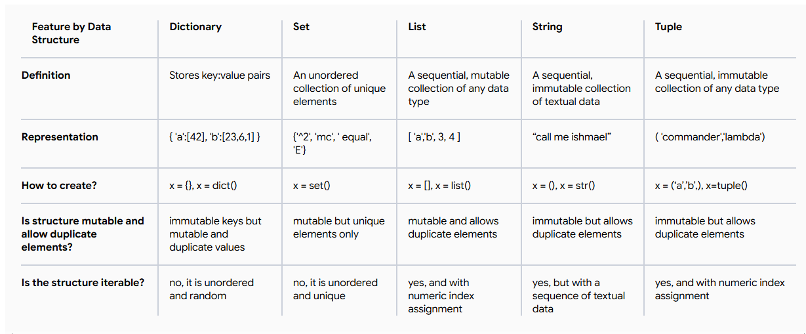

# Diccionarios

## Reseña: Qué es un diccionario
- Los siguientes bloques de código se usarán en el próximo video:
```Python
x = {}
type(x)

file_counts = {"jpg":10, "txt":14, "csv":2, "py":23}
print(file_counts)

file_counts = {"jpg":10, "txt":14, "csv":2, "py":23}
file_counts["txt"]

file_counts = {"jpg":10, "txt":14, "csv":2, "py":23}
"jpg" in file_counts
"html" in file_counts

file_counts = {"jpg":10, "txt":14, "csv":2, "py":23}
file_counts["cfg"] = 8
print(file_counts)

file_counts = {"jpg":10, "txt":14, "csv":2, "py":23}
file_counts["csv"] = 17
print(file_counts)

file_counts = {"jpg":10, "txt":14, "csv":2, "py":23, 'cfg':8}
del file_counts["cfg"]
print(file_counts)
```

---

## Qué es un diccionario
- Son usados para organizar elementos en colecciones
- Los datos en diccionarios adoptan la forma de pares de clave-valor
- Separamos clave de valor con dos puntos (:)
- Ejemplo: `{"clave1": valor1, "clave2": valor2, "clave3": valor3}`
- a diferencia de listas o tuplas, puedes usar otros elementos que sean integer como indices, como strings, floats, o incluso tuplas como claves
- Para acceder a un valor en un diccionario, usamos la clave entre corchetes: `diccionario[clave]`
- Para agregar un nuevo par clave-valor, usamos la sintaxis: `diccionario[nueva_clave] = nuevo_valor`
- Podemos modificar un archivo usando la misma sintaxis que para agregar un nuevo par clave-valor, ejemplo: `diccionario[clave_existente] = nuevo_valor`
- Para eliminar un par clave-valor, usamos la sintaxis: `del diccionario[clave]`

---

## Definición de diccionarios
- Los diccionarios son otra estructura de datos en Python, similares a las listas.
- Para crear un diccionario, se utilizan llaves: {}.
- Al almacenar valores en un diccionario, primero se especifica la clave, seguida del valor correspondiente, separados por dos puntos.
- Por ejemplo, `animals = { "bears":10, "lions":1, "tigers":2 }` crea un diccionario con tres pares clave-valor, almacenados en la variable `animals`.
- La clave "osos" apunta al valor entero 10, mientras que la clave "leones" apunta al valor entero 1, y "tigres" apunta al valor entero 2.
- Puedes acceder a los valores haciendo referencia a la clave, así: `animales["osos"]`. Esto devolverá el entero 10
- Puedes comprobar si una clave está contenida en un diccionario usando la palabra clave `in`.
- Al igual que en otros usos de esta palabra clave, devolverá `True` si la clave se encuentra en el diccionario; de lo contrario, devolverá `False`.
- Los diccionarios son mutables, lo que significa que se pueden modificar añadiendo, eliminando y reemplazando elementos, de forma similar a las listas.
- Puedes añadir un nuevo par clave-valor a un diccionario: `animales["cebras"] = 2`.
- Puedes modificar el valor de una clave: `animals["bears"] = 11` cambiaría el valor almacenado en la clave `bears` de 10 a 11.
- Puedes eliminar elementos de un diccionario usando la palabra clave `del`: `del animals["lions"]`, eliminarías el par clave-valor del diccionario `animals`.

---

## Reseña: Iterando sobre el contenido de un diccionario
- Los siguientes bloques de código se usarán en el próximo video:
```Python
file_counts = {"jpg":10, "txt":14, "csv":2, "py":23}
for extension in file_counts:
  print(extension)

file_counts = {"jpg":10, "txt":14, "csv":2, "py":23}
for ext, amount in file_counts.items():
  print("There are {} files with the .{} extension".format(amount, ext))

file_counts = {"jpg":10, "txt":14, "csv":2, "py":23}
file_counts.keys()
file_counts.values()

file_counts = {"jpg":10, "txt":14, "csv":2, "py":23}
for value in file_counts.values():
  print(value)

def count_letters(text):
  result = {}
  for letter in text:
    if letter not in result:
      result[letter] = 0
    result[letter] += 1
  return result
count_letters("aaaaa")
count_letters("tenant")
count_letters("a long string with a lot of letters")
```

---

## Iterando sobre el contenido de un diccionario
- Puedes iterar sobre un diccionario usando un bucle `for`.
- Por defecto, el bucle `for` iterará sobre las claves del diccionario.
- Para obtener tanto la clave como el valor, puedes hacer un `unpacking` de los elementos del diccionario usando el método `items()`.
- Para obtener solo las claves o los valores, puedes usar los métodos `keys()` y `values()`, respectivamente.

---

## Usando bucles `while` y `if-else` con diccionarios
- Puedes usar el diccionario en un bucle `while` para iterar sobre sus elementos.
- Iterará hasta pasar por cada elemento del diccionario, una vez no hayan más elementos, el bucle se detendrá.
- Para la condición `if-else`, puedes usar el diccionario para verificar si una clave está presente en él.
- Esto se hace usando la palabra clave `in`, que devolverá `True` si la clave está presente y `False` si no lo está.
```Python
# Check if a key exists in the dictionary and perform different actions based on the result
key = 'banana'
if key in myDictionary:
	print(f"The value of {key} is {myDictionary[key]}")
else:
	print(f"{key} is not found in the dictionary")
```

---

## Diccionarios vs listas
- Si tiene una lista de información ​que le gustaría recopilar y usar en su script, ​probablemente una lista sea el enfoque correcto
- Por ejemplo, si desea ​almacenar una serie de direcciones IP para Ping, ​puede ponerlas todas en una lista e iterar sobre ellas. ​O si tiene una lista de ​nombres de host y sus direcciones IP correspondientes, ​es posible que desee emparejarlos ​como valores clave en un diccionario.
- En general, querrá usar diccionarios ​cuando planee buscar un elemento específico. 
- Puede utilizar los diccionarios para representar ​estructuras de datos más complejas, ​como árboles de directorios en un sistema de archivos. 

- El tipo de dato `Set` es otra estructura de datos que puede usar para almacenar información.
- Los `Sets` son colecciones desordenadas de elementos únicos, lo que significa que no permiten duplicados.
- Los `Sets` son útiles cuando desea asegurarse de que no haya elementos duplicados en su colección.

---

## Connect: Tipos de iterables



---

## Guía de estudio: Métodos de diccionarios
- Operadores:
    - `len(diccionario)` - Devuelve el número de elementos en un diccionario.
    - `for key in dictionary` - Itera sobre cada clave en un diccionario.
    - `for key, value in dictionary.items()` - Itera sobre cada par clave-valor en un diccionario.
    - `if key in dictionary` - Comprueba si una clave está en un diccionario.
    - `diccionario[clave]` - Accede a un valor usando la clave asociada en un diccionario.
    - `diccionario[clave] = valor` - Establece un valor asociado a una clave.
    - `del diccionario[clave]` - Elimina un valor usando la clave asociada en un diccionario.
    - `merged_dict = dict1 | dict2` - Crea un nuevo diccionario con los elementos combinados de ambos (por ejemplo, operador merge). Si ambos diccionarios comparten una clave, el valor de dict2 (el de la derecha) prevalece y sobrescribe el primero. (Python 3.9+)
    - `dict1 |= dict2` - Operador de actualización: Actualiza el diccionario original con elementos de otro diccionario (por ejemplo, mediante el operador de actualización). (Python 3.9+)
- Métodos:
    - `diccionario.get(clave, valor_predeterminado)` - Devuelve el valor correspondiente a una clave, o el valor predeterminado si la clave especificada no está presente.
    - `diccionario.claves()` - Devuelve una vista en tiempo real de las claves. Es iterable (se puede usar en bucles for), pero no indexable (no se puede usar [0]).
    - `diccionario.valores()` - Devuelve un objeto de vista de los valores. Al igual que las claves, se actualiza automáticamente si el diccionario cambia.
    - `diccionario[clave].append(valor)` - Agrega un nuevo valor a una clave existente solo si el valor es una secuencia mutable (por ejemplo, una lista).
    - `diccionario.actualizar(otro_diccionario)` - Actualiza un diccionario con los elementos de otro diccionario. Se actualizan las entradas existentes y se agregan las nuevas.
    - `diccionario.limpiar()` - Elimina todos los elementos de un diccionario.
    - `diccionario.copiar()` - Crea una copia de un diccionario.

---

## Test your knowledge: Dictionaries
1. The email_list function receives a dictionary, which contains domain names as keys, and a list of users as values. Fill in the blanks to generate a list that contains complete email addresses (e.g. diana.prince@gmail.com).
```Python
def email_list(domains):
	emails = []
	for domain, users in domains.items():
	  for user in users:
	    emails.append(f"{user}@{domain}")
	return(emails)

print(email_list({"gmail.com": ["clark.kent", "diana.prince", "peter.parker"], "yahoo.com": ["barbara.gordon", "jean.grey"], "hotmail.com": ["bruce.wayne"]}))
```

2. The groups_per_user function receives a dictionary, which contains group names with the list of users. Users can belong to multiple groups. Fill in the blanks to return a dictionary with the users as keys and a list of their groups as values. 
```Python
def groups_per_user(group_dictionary):
	user_groups = {}
	# Go through group_dictionary
	for group, users in group_dictionary.items():
		# Now go through the users in the group
		for user in users:
			# Now add the group to the the list of
# groups for this user, creating the entry
# in the dictionary if necessary
			if user not in user_groups:
				user_groups[user] = []
			user_groups[user].append(group)

	return(user_groups)

print(groups_per_user({"local": ["admin", "userA"],
		"public":  ["admin", "userB"],
		"administrator": ["admin"] }))
```

3. The dict.update method updates one dictionary with the items coming from the other dictionary, so that existing entries are replaced and new entries are added. What is the content of the dictionary “wardrobe“ at the end of the following code?
```Python
wardrobe = {'shirt': ['red', 'blue', 'white'], 'jeans': ['blue', 'black']}
new_items = {'jeans': ['white'], 'scarf': ['yellow'], 'socks': ['black', 'brown']}
wardrobe.update(new_items)
```
> {'shirt': ['red', 'blue', 'white'], 'jeans': ['white'], 'scarf': ['yellow'], 'socks': ['black', 'brown']}

4.  What’s a major advantage of using dictionaries over lists?
> It’s quicker and easier to find a specific element in a dictionary

5. The add_prices function returns the total price of all of the groceries in the  dictionary. Fill in the blanks to complete this function.
```Python
def add_prices(basket):
	# Initialize the variable that will be used for the calculation
	total = 0
	# Iterate through the dictionary items
	for price in basket.values():
		# Add each price to the total calculation
		# Hint: how do you access the values of
		# dictionary items?
		total += price
	# Limit the return value to 2 decimal places
	return round(total, 2)  

groceries = {"bananas": 1.56, "apples": 2.50, "oranges": 0.99, "bread": 4.59, 
	"coffee": 6.99, "milk": 3.39, "eggs": 2.98, "cheese": 5.44}

print(add_prices(groceries)) # Should print 28.44
```