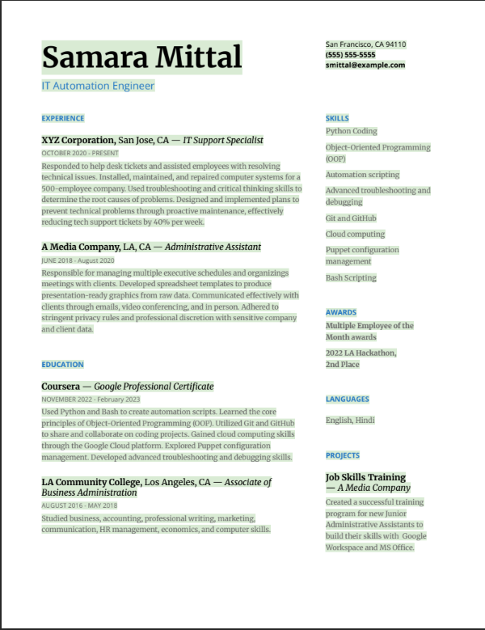

# Buscando un nuevo trabajo o un ascenso.

## Encontrar tu camino y el rol perfecto
- Tendrás que orientarte para encontrar el puesto perfecto para ti.
- Si bien no existe una única manera de encontrar tu trabajo ideal, hay algunos aspectos que puedes considerar para comprender mejor la dirección que deseas tomar.

- Generalista vs. Especialista
- Un generalista tiene conocimientos sobre muchos temas y diversos intereses, mientras que un especialista es un experto en un campo específico.
- Los generalistas desempeñan roles amplios y multifacéticos que permiten a los empleados principiantes adquirir una valiosa experiencia en muchas áreas diferentes relacionadas con el sector.
- Por otro lado, los especialistas se centran en un aspecto específico de las TI.
- La siguiente lista ofrece una descripción general de los roles generales y especializados más comunes.

- Roles Generalistas Comunes
    - Especialista de Soporte de TI II
    - Consultor de TI
    - Gerente de TI
    - Roles Especialistas Comunes
    - Ingeniero de Automatización
    - Desarrollador de Python
    - Ingeniero de Software
    - Ingeniero de la Nube

- Ten en cuenta que el término "especialista" se usa con frecuencia en los títulos de los puestos, incluso para roles que incluyen tareas generales.
- Al revisar una oferta de trabajo, asegúrese de leer las funciones y responsabilidades asignadas al puesto para comprender claramente lo que hará si es contratado.

- Elija su entorno laboral
- Los diferentes tipos de entornos tienen sus propias culturas y prácticas.
- Como empleado de nivel inicial, encontrará dos tipos de lugares de trabajo: agencia o empresa.
- También puede optar por trabajar por cuenta propia como freelance o incluso iniciar su propio negocio.

- Equipos de agencia vs. Equipos internos
- En el campo de TI, existen agencias especializadas que ofrecen servicios de TI y personal técnico a otras empresas mediante contratos.
- Estas agencias pueden brindar soporte a múltiples pequeñas y medianas empresas y, a menudo, operan de forma independiente de las empresas a las que prestan servicios.
- Como empleado de nivel inicial en una agencia de servicios de TI, puede esperar brindar servicios a varios clientes.
- Los contratos a corto plazo también son comunes en las agencias.
- Es posible que las agencias ofrezcan o no beneficios laborales a su personal técnico contratado.
- Por otro lado, las grandes empresas suelen contar con un equipo interno de empleados para gestionar sus necesidades de TI.
- Si bien contratar un departamento de TI interno es costoso, las grandes empresas prefieren tener total transparencia con su equipo de TI y control absoluto sobre la privacidad de sus usuarios e información confidencial.
- Como empleado de nivel inicial en un departamento de TI interno, puede esperar trabajar en estrecha colaboración con un equipo de TI con diversas habilidades técnicas.
- Es común desarrollar relaciones sólidas con los miembros del equipo, ya que se apoyan mutuamente en proyectos a largo plazo.
- Los empleados de los departamentos de TI internos suelen tener puestos permanentes a tiempo completo y reciben beneficios laborales.

- Grandes empresas vs. pequeñas empresas
- Quizás prefieras trabajar presencialmente en una gran empresa por su ambiente social diverso y las oportunidades para establecer contactos profesionales.
- Algunas grandes empresas ofrecen cafeterías, gimnasios y guarderías en sus instalaciones, además de paquetes de beneficios para empleados completos y oportunidades de desarrollo profesional.
- O tal vez prefieras trabajar en una empresa más pequeña donde puedas establecer relaciones laborales más cercanas con equipos reducidos.
- Quizás te interese trabajar para una empresa que ofrezca horarios flexibles y opciones que te permitan trabajar desde casa, en la oficina o una combinación de ambos.

---

## Explorando carreras técnicas
- Este Certificado Profesional de Google forma parte de un proyecto más amplio llamado [Crece con Google (GWG)](https://grow.google/).
- GWG ofrece otras certificaciones que te ayudarán a seguir creciendo y a acceder a mejores oportunidades laborales.
- Entre los certificados profesionales que se ofrecen se incluyen:

1. Certificado Profesional de Análisis de Datos de Google
- Lleva tus habilidades de programación al siguiente nivel con el lenguaje R en el Certificado Profesional de Análisis de Datos de Google, donde aprenderás:
- Tipos y estructuras de datos
- Cómo usar los datos para resolver problemas
- Cómo analizar datos
- Cómo contar historias con datos mediante visualizaciones
- Cómo usar la programación en R para potenciar tu análisis
- Para obtener más información sobre esta certificación, visita:
- [Certificado Profesional de Análisis de Datos de Google](https://www.coursera.org/professional-certificates/google-data-analytics?utm_source=google&utm_medium=institutions&utm_campaign=gwgsite&_ga=2.162463295.2090059014.1666639119-999957063.1665442478)

2. Certificado Profesional de Ingeniero de Redes en la Nube de Google
- Amplía tus habilidades de automatización para gestionar máquinas virtuales en la nube. Descubre el Certificado Profesional de Ingeniero de Redes en la Nube, donde te prepararás para el examen de certificación de Ingeniero de Redes en la Nube de Google Cloud y aprenderás sobre:
- Habilidades de ingeniería de redes en la nube
- Implementación de VPC
- Conectividad híbrida
- Servicios de red
- Seguridad para arquitecturas de red establecidas en Google Cloud
- Para obtener más información sobre esta certificación, visita:
- [Certificado Profesional de Ingeniero de Redes en la Nube](https://www.coursera.org/professional-certificates/google-cloud-networking#courses)

- También puedes impulsar tu carrera profesional obteniendo cualquiera de estas certificaciones profesionales de Google Cloud:
- [Certificado Profesional de Ingeniero de Redes en la Nube](https://www.coursera.org/professional-certificates/google-cloud-networking#courses)
- [Especialización en Redes en Google Cloud](https://www.coursera.org/specializations/networking-google-cloud-platform)
- [Especialización en Seguridad en Google Cloud](https://www.coursera.org/specializations/security-google-cloud-platform)
- [Gestión de Proyectos de Google: Certificado Profesional](https://www.coursera.org/professional-certificates/google-project-management?utm_source=google&utm_medium=institutions&utm_campaign=gwgsite-gDigital-paidha-sem-bk-gen-exa-glp-br-null&_ga=2.188375912.1961931751.1662579108-93933645.1661442239&_gac=1.53335386.1662581105.Cj0KCQjwguGYBhDRARIsAHgRm4_ThGr6fU1Y69wQRJqSe4hRoAyagufS1Gxs5_2mKay1uQyK6qU_Hs4aAqT_EALw_wcB)
- [Diseño UX de Google: Certificado Profesional](https://www.coursera.org/professional-certificates/google-ux-design?utm_source=google&utm_medium=institutions&utm_campaign=gwgsite-gDigital-paidha-sem-bk-gen-exa-glp-br-null&_ga=2.150176886.1961931751.1662579108-93933645.1661442239&_gac=1.83696996.1662579831.Cj0KCQjwguGYBhDRARIsAHgRm4_ThGr6fU1Y69wQRJqSe4hRoAyagufS1Gxs5_2mKay1uQyK6qU_Hs4aAqT_EALw_wcB#courses)

3. Certificado de Soporte de TI de Google
- Este programa lleva tus conocimientos básicos de TI al siguiente nivel, enseñándote a programar con Python y a automatizar tareas comunes de administración de sistemas.
- A lo largo de 5 cursos, aprenderás:
- Fundamentos de soporte técnico
- Resolución de problemas y atención al cliente
- Redes informáticas
- Sistemas operativos
- Administración de sistemas
- Seguridad
- Para obtener más información sobre esta certificación, visita:
- [Certificado Profesional de Soporte de TI de Google](https://www.coursera.org/professional-certificates/google-it-support?utm_source=google&utm_medium=institutions&utm_campaign=gwgsite&_ga=2.262561167.2090059014.1666639119-999957063.1665442478)

---

## Adapta tu currículum
- Mientras se prepara para su búsqueda de empleo, necesitará crear o actualizar su currículum para reflejar su experiencia con el fin de solicitar puestos como:
    - Ingeniero de automatización
    - Desarrollador de Python de nivel básico
    - Especialista en Asistencia de TI II
    - Ingeniero de software principiante
    - Ingeniero de redes
    - ...y otros puestos similares
- Adapta el contenido
    - Identifica lo que es importante para el empleador potencial.
        - ¿Qué quiere saber de ti? Asegúrate de leer detenidamente la descripción del puesto y fíjate en qué habilidades se mencionan. 
        - También puede leer varias descripciones del mismo tipo de puesto para saber qué competencias y requisitos aparecen con frecuencia. 
        - Por ejemplo, aunque los detalles varían según el puesto y el empleador, muchas funciones relacionadas con la automatización de Python requieren la capacidad de organizar y coordinar eficazmente equipos y proyectos, gestionar varias tareas a la vez y comunicarse con eficacia
        - Deberías tomar nota de estas habilidades y asegurarte de destacarlas utilizando términos similares en tu currículum.
    - Crea un currículum principal para editarlo y adaptarlo a cada solicitud de empleo
        - Asegúrese de que el orden de sus competencias y cualificaciones coincide con la descripción del puesto
        - De este modo, te aseguras de que lo más importante para el empleador está en primer lugar
    - Concuerde con el lenguaje utilizado en la descripción del puesto
        - Algunas empresas utilizan programas de automatización para filtrar los currículos
        - Si la descripción del puesto utiliza palabras clave como servicios en la nube y Gestión de riesgos, asegúrate de que tu currículum también las utiliza.
    - Utiliza terminología de automatización de Python
        - ayudará al responsable de contratación que lea tu currículum a entender por qué tu experiencia anterior es relevante para el puesto al que optas.
    - Decide qué no incluir en tu currículum
        - Puede que tengas algunas habilidades que sean importantes para ti, pero esas mismas habilidades pueden confundir o distraer a los responsables de contratación que lean tu currículum.
    - Destaque cómo su experiencia y sus habilidades son relevantes para el puesto
        - Si has estado trabajando como Especialista en Asistencia de TI pero quieres convertirte en Ingeniero de Automatización de Python, tus habilidades para solucionar problemas serán esenciales en tu nuevo puesto.
        - Asegúrate de señalar cómo esas habilidades serán beneficiosas para el empleador. 
- Elija un formato adecuado
    - El diseño de tu currículum debe ser sencillo y fácil de entender tanto para los lectores humanos como para los de Inteligencia artificial
    - No querrás que tu currículum sea descartado antes de que una persona real tenga la oportunidad de leerlo.
    - Tu currículum debe ser fácil de leer y comunicar toda la información importante en breves viñetas.
    - Su currículum debe tener entre una y dos páginas y contener sólo los últimos diez o quince años de experiencia relevante.
    - Es apropiado utilizar dos columnas en un currículum de una página, pero si tu currículum es de dos páginas, asegúrate de utilizar todo el ancho de la página.
- Actualice las secciones pertinentes
    - Información de contacto
    - Resumen profesional
    - Competencias básicas
    - Experiencia profesional
    - Formación y certificaciones

>[!TIP]
>  Los currículos deben redactarse en tercera persona y no deben contener pronombres personales.

- Información de contacto
    - El encabezado debe incluir la siguiente información
        - Tu nombre en un tipo de letra más grande que el resto del currículum
        - La ciudad y el estado en que vives ( no es necesario que incluyas tu dirección por motivos de privacidad)
        - Tu número de teléfono y un enlace a tu dirección de correo electrónico
        - Enlace a la URL de su perfil de LinkedIn
        - Enlaces a otros sitios web personales o portafolios, si son aplicables al puesto que solicita
    - El encabezamiento debe ser pertinente, sencillo y fácil de leer
- Resumen profesional
    - Utilízalo para establecer el tono
        - Debe constar de una a tres líneas y explicar claramente por qué es usted el mejor candidato para el puesto.
        - Debe mostrar las cosas más importantes que quieres que el lector sepa de ti.
        - Si está solicitando un nuevo puesto, querrá actualizar su especialidad sectorial.
        - Es probable que tenga experiencia relacionada con el pensamiento crítico y la resolución de problemas complejos. 
        - Querrá incorporar esa experiencia relevante a su nuevo resumen profesional.
        - Asegúrese de adaptar la descripción de sí mismo al puesto que solicita.
    - Combine la descripción del puesto que solicita con su experiencia
    ```txt
    Ingeniero de automatización con dos años de éxito demostrado en la resolución de problemas complejos. Hábil en la colaboración interfuncional y la ejecución de proyectos. Comunicador elocuente que se desenvuelve bien en un entorno de colaboración orientado a los resultados.

    Ingeniero de automatización de nivel básico. Dominio de Python y Bash, computación en la nube y depuración de código. Hábil en la colaboración con equipos técnicos para identificar e implementar soluciones para problemas técnicos.
    ```
    - Utiliza palabras clave de la descripción del puesto para describirte
        - Si en la descripción del puesto se indica que la empresa busca un candidato con conocimientos de computación en la nube, Linux o secuencias de comandos Bash, debe añadirlo a su currículum: usted ha adquirido esos conocimientos con esta certificación.

>[!TIP]
> No olvide utilizar esta sección para destacar algo que le haga sobresalir de los demás candidatos. Utilice un logro de un puesto anterior para mostrar al empleador lo que puede ofrecerle. Echa un vistazo a este ejemplo de sección de resumen profesional:

- Competencias básicas
    - Tus competencias básicas deben ser una lista con viñetas de las habilidades más relevantes aplicables al puesto al que optas.
    ```txt
    Competencias principales
    - Codificación en Python                            - Git y GitHub
    - Programación orientada a objetos (POO)            - Computación en la nube con Google Cloud
    - Automatización de scripts                         - Administración de configuraciones con Puppet
    - Solución avanzada de problemas y depuración       - Secuencias de comandos Bash
    ```

>[!TIP]
> Estudia la descripción del puesto en busca de las competencias básicas que has adquirido durante esta certificación y tu experiencia anterior y, a continuación, utiliza esas habilidades como viñetas en esta sección.
> Asegúrate de que esta sección sea relativamente corta, con entre cuatro y ocho viñetas.


- Experiencia profesional
    - La sección de experiencia profesional de tu currículum ofrece un resumen de las funciones y puestos que has ocupado a lo largo de tu carrera
    - Enumere al menos tres puestos en orden cronológico inverso e incluya únicamente lo más relevante para el puesto al que opta.
    - Tu experiencia profesional no cambiará mucho respecto a currículos anteriores, porque no puedes cambiar las funciones que has desempeñado en el pasado.
    - Sin embargo, puedes reescribir algunas de tus viñetas para relacionarlas con los requisitos del puesto al que aspiras.
    - Asegúrate de que relacionas la jerga del sector con tu experiencia previa para mostrar al lector -normalmente un responsable de contratación- cómo se relacionan tus habilidades con el puesto anunciado.
    - Puedes utilizar términos como resolución de problemas, pensamiento crítico, pruebas, implementación y mantenimiento de software para mostrar al lector que tu experiencia previa se traduce en un puesto de automatización de Python o de ingeniería de software.
        - **Problema** que había que resolver
        - **Acción(es)** que emprendí
        - **Resultado** de la acción
        - **Impacto** en el proyecto (usuarios, calidad, etc.)
        - **Justificantes** (premios, bonificaciones, etc.)

>[!TIP]
>  Asegúrate de que tu currículum transmite cómo tus logros anteriores son valiosos para el puesto al que optas. Muestra al lector cómo puedes marcar la diferencia en su organización. Una forma fácil de recordar esto es a través del marco P.A.R.I.S.:


- Formación y certificados
    - En esta sección de tu currículum, debes incluir todos los títulos posteriores al bachillerato en orden cronológico inverso.
    - Para cada titulación, indique el título obtenido, la institución, el lugar y la fecha de graduación.
    - En esta sección también debe enumerar todas las certificaciones, licencias o credenciales profesionales que posea.
    - Aquí es donde debes incluir tu nuevo certificado profesional de Google.

>[!TIP]
> Siempre es una buena idea pedir a alguien que revise tu currículum en busca de errores ortográficos o gramaticales.
> Los responsables de contratación suelen desechar los currículos que contienen errores tipográficos.
> Una vez que esté seguro de que su currículum no contiene errores, ¡es hora de empezar a buscar trabajo!

Ejemplo de currículum

[Link](https://docs.google.com/document/d/1OuGb1T5GHBF-WpR78AiONP8lijNcDFsbhWEB6-rmFR8/template/preview?usp=sharing)

---

## Diversidad e inclusión
- La diversidad en el lugar de trabajo representa la forma en que las organizaciones y sus empleados conectan, se comprometen y respetan a las personas con todo tipo de diferencias
- Las empresas con buenas métricas de DEI tienden a tener mayores tasas de retención de empleados, empleados más satisfechos y una mayor innovación.
- Examine la dirección de la empresa en la que desea trabajar
- Las personas que trabajan en el nivel ejecutivo suelen ser un buen indicador del grado de diversidad y representación de sus empleados
- Si la dirección ejecutiva de una empresa no adopta la diversidad, los empleados tendrán más dificultades para crear y mantener esa cultura. Algunas preguntas que debe hacerse al investigar sobre las empresas
    - ¿Comparte la empresa abiertamente sus progresos?
    - ¿Ofrecen oportunidades de educación y formación para aprender más sobre la DEI y cómo afecta a las personas en el lugar de trabajo?
- Hay varias formas de evaluar si una empresa practica o no la diversidad y la inclusión. He aquí algunos recursos para explorar y conocer mejor la empresa:
    - La página web de la empresa. Evalúe sus valores fundamentales, su historia, su misión y sus palabras clave. Comprueba si su sitio web incluye fotografías de sus empleados.
    - Sus redes sociales. ¿Qué tipo de fotos y contenidos publican? Comprueba si hay fotos de sus empleados, salidas a la comunidad, si reconocen o celebran diversos acontecimientos o momentos históricos como el mes del orgullo, el mes de la historia negra o el día mundial de la salud mental, por poner un par de ejemplos.
    - Entreviste a antiguos empleados. Realice entrevistas informativas para conocer mejor la empresa en general y asegurarse de que la cultura del lugar de trabajo se adapta bien a usted.
- Sesgo implícito o inconsciente
    - El sesgo inconsciente o implícito se refiere a las actitudes, estereotipos, juicios o prejuicios que tenemos inconscientemente en nuestro cerebro.
    - Este sesgo hace que nuestras reacciones, pensamientos y predisposición a la información, acciones o entornos se alteren de una manera determinada, ya sea positiva o negativa, sin que seamos conscientes de ello.
    - Ocurre fuera de nuestro control y puede afectar a nuestras decisiones, acciones y comprensión.
    - Los prejuicios inconscientes están asociados a muchas características, como la raza, la etnia, el sexo, la religión, la orientación sexual, el nivel socioeconómico y el nivel educativo
        - Sesgo de afinidad, que se refiere a las preferencias a la hora de elegir a las personas con las que conectar. Estas personas comparten intereses, experiencias y antecedentes similares a los suyos.
        - El sesgo de atribución, que se refiere a la forma en que percibes tus acciones en comparación con las de los demás. Este sesgo se asocia sobre todo a la forma de percibir el éxito y el fracaso.
        - La discriminación por edad, que se refiere a sentimientos negativos o discriminaciones contra alguien por su edad.
        - El sesgo de belleza, que consiste en relacionar el aspecto físico de una persona con su éxito, competencia o cualificaciones.
        - Prejuicio de género: preferencia por un género en detrimento de otros.
        - Sesgo de aptitud, que se refiere a percibir a las personas sin discapacidad como la norma y a las personas con discapacidad como que deben esforzarse por rendir al mismo nivel que las personas sin discapacidad sin las adaptaciones necesarias.
    - Para identificar nuestros propios sesgos, es importante saber cuáles son algunas de las causas del sesgo inconsciente/implícito. El sesgo se produce porque, como seres humanos, somos susceptibles a las tendencias y somos criaturas de hábitos.
    - Lo cierto es que, sean cuales sean las causas, somos susceptibles al sesgo implícito, y esto podría afectar a nuestras relaciones en el trabajo, a la forma en que nos comportamos en determinadas ocasiones, a las decisiones que tomamos y a cómo reaccionamos en nuestro entorno laboral.
- Puntos clave
    - Todos somos humanos, cada uno con nuestros propios pensamientos y opiniones. Es importante reconocer que no todos pensamos igual.
    - El sesgo inconsciente/implícito es un resultado inevitable del ser humano y puede influir en las decisiones cotidianas de nuestra vida personal y profesional.
    - Asegúrate de ser consciente de los sesgos inconscientes/implícitos cuando estés en el lugar de trabajo teniendo una mentalidad abierta.
    - Una cultura de la diversidad, la equidad y la inclusión comienza con el liderazgo ejecutivo en cualquier organización.
    - La educación y la formación continuas son muy importantes y eficaces para reducir los prejuicios en el trabajo y promover una cultura de diversidad, equidad e inclusión.